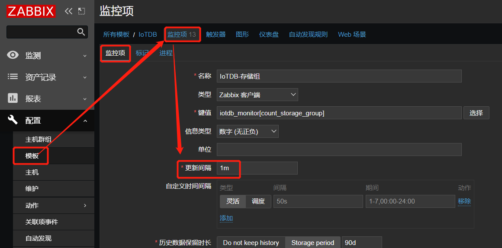
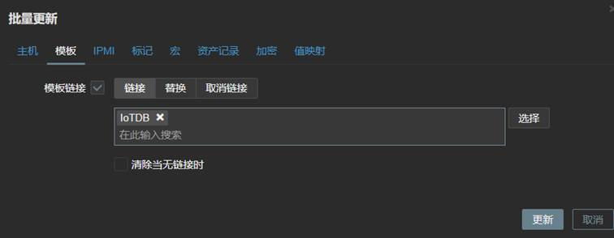
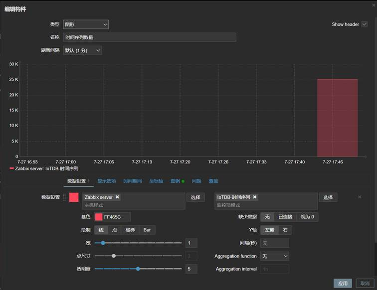
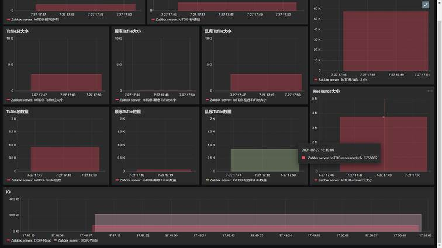

# iotdb-zabbix监控安装方式  
> * zabbix版本  
5.4.3  
> * agent操作系统版本   
Ubuntu 20.04.2 LTS   
## 依赖  
> * 操作系统：Linux  
> * python >=3.8   
> * zabbix_get   
```
apt-get install zabbix-get
```
> * apache-iotdb(python)   
```
pip3 install apache-iotdb
```
## 安装步骤
>1. 安装zabbix-agent  
在IoTDB所在服务器安装zabbix-agent并完成配置  
>2. 修改agent配置  
```
vim /etc/zabbix/zabbix_agentd.conf
新增
Include=/etc/zabbix/zabbix_agentd.d/iotdb_monitor.conf
```
>3. 新建iotdb_monitor.conf  
新建文件，并增加内容：  
```
vim /etc/zabbix/zabbix_agentd.d/iotdb_monitor.conf
增加：
UserParameter=iotdb_monitor[*],/usr/bin/python3.8 /etc/zabbix/scripts/iotdb_monitor.py "$1"
# python3.8修改为实际python3.8地址
```

>4. 下载iotdb-monior脚本  
```
git clone https://github.com/xiaoyekanren/iotdb-zabbix.git
```

>5. 修改config.ini  
```
home=/home/ubuntu/apache-iotdb-0.12.1-server-bin  # 必填，修改为IoTDB实际路径
data=  # 多个路径使用逗号(英文)隔开；若未修改data路径，留空
wal=  # 若未修改wal路径，留空
```

>6. 将脚本放入zabbix文件夹  
将修改好的config.ini和iotdb_monitor.py 两个文件放入/etc/zabbix/scripts/下  
```
mkdir /etc/zabbix/scripts/
cp -r config.ini iotdb_monitor.py /etc/zabbix/scripts/
```

>7. 重启zabbix-agent  
```
systemctl restart zabbix-agent
```

## 配置监控项  
打开zabbix网页  
>1. 导入模板  
依次点击，配置→模板→导入模板，导入git仓库里的下的iotdb_monitor.yaml  
导入完成之后，可点击模板“IoTDB”→“监控项”，可根据实际调整各个监控间隔，默认间隔是1m  
  

当前可用监控项：  
1. 统计时间序列数量，count_timeseries,int  
2. 统计存储组数量，count_storage_group,int  
3. 统计顺序文件数量，count_seq,int  
4. 统计顺序文件大小，sum_seq,int  
5. 统计乱序文件数量，count_unseq,int  
6. 统计乱序文件大小，sum_unseq,int  
7. 统计全部tsfile文件数量，count_all,int  
8. 统计全部tsfile文件大小，sum_all,int  
9. 统计全部resource文件大小，sum_resource,int  
10. 统计wal目录大小，sum_wal,int  
11. 统计顺序0层tsfile数量，count_seq_lv0,int  
12. 统计乱序0层tsfile数量，count_unseq_lv0,int  


>2. 更新主机
依次点击，配置→主机→选择IoTDB主机→批量更新→模板→选择“Linux Servers”→"IoTDB"→更新  
  
>3. 查看最新数据  
等待一分钟后，可在 检测→最新数据，查看实时数据  

## 建立dashboard   
返回首页，添加仪表盘→创建仪表盘，将相关依赖项纳入监控即可  
    
    


## tips  
1. 注意用户权限，在普通用户下安装的pip依赖会放到~下，使用root运行python的话也许需要重新安装依赖  

## 未完成   
1. memtable 大小   
2. 刷的频率   
3. 刷的单个花费时间  
avg points, avg time series  
4. 一分钟查询的个数  
5. 一分钟session登录的数量  
    //这个代表客户端创建client的数量么？  
6. 数据趋势  
    --用来观测数据在不同时间下的趋势变化，总结行业经验  
7. 日志中新出现的error数量  
8. 日志中新出现的warn数量  
